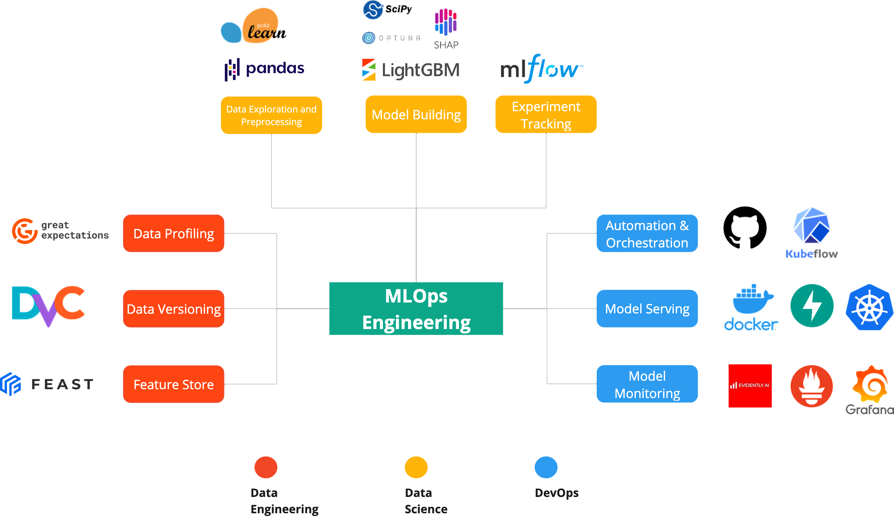

# Mining-quality-prediction

## About
The target is to predict the % of Silica in the end of the process, which is the concentrate of iron ore and its impurity (which is the % of Silica).

Data Reference: [Kaggle](https://www.kaggle.com/edumagalhaes/quality-prediction-in-a-mining-process)

## Tech Stack

### DATA ENGINEERING
- Data Profiling: Great Expectations
- Data Versioning: DVC
- Feature Store: Feast

### DATA SCIENCE
- Data Exploration and Preprocessing: Pandas, Matplotlib, Seaborn
- Model Training: LightGBM, Optuna, SHAP
- Experiment Tracking: MLflow

### DEVOPS/MLOPS
- CICD: GitHub Actions
- ML Orchestrator: Kubeflow
- Model Monitoring: Evidently, Prometheus, Grafana
- Model Serving: FastAPI, Docker, Kubernetes