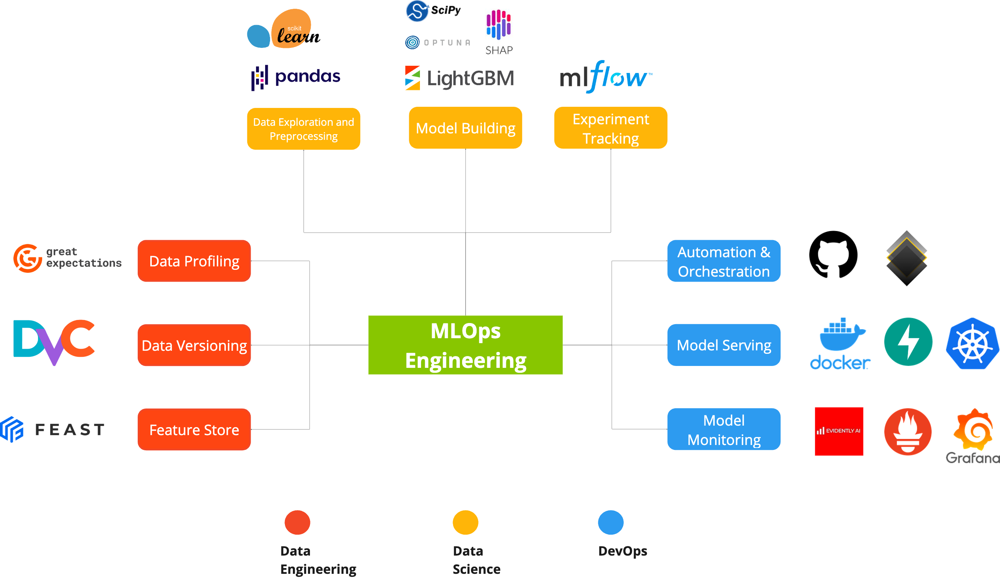

# Mining-quality-prediction

## About
Predictive Analytics: The aim is to predict the % of Silica in the end of the process, which is the impure concentrate of iron ore in a flotation plant. 

Prescriptive Analytics: The aim is to minimize the % of Silica by suggesting the best operating parameters of the flotation plant

Data Reference: [Kaggle](https://www.kaggle.com/edumagalhaes/quality-prediction-in-a-mining-process)

## Tech Stack

#### DATA ENGINEERING
- Data Profiling: Great Expectations
- Data Versioning: DVC
- Feature Store: Feast

#### DATA SCIENCE
- Data Exploration and Preprocessing: Pandas, Matplotlib, Seaborn
- Model Training: LightGBM, Optuna, SHAP
- Experiment Tracking: MLflow

#### DEVOPS
- Automation and Orchestration: GitHub Actions, Kedro
- Model Monitoring: Evidently, Prometheus, Grafana
- Model Serving: FastAPI, Docker, Kubernetes

## Configuration

#### Git
- To re-enable git ssh key and its connection to GitHub:
  - `ssh-add -K <path to private key>`

#### MLflow
- To start MLflow UI:
  - `cd orchestration/mlruns`
  - `mlflow server --host 127.0.0.1 --port 8080`

#### Kedro
- To run Kedro pipeline:
  - `kedro run --pipeline=data_engineering` (for preprocessing pipeline)
  - `kedro run --pipeline=science_pipeline` (for model training, tuning and evaluation pipeline)